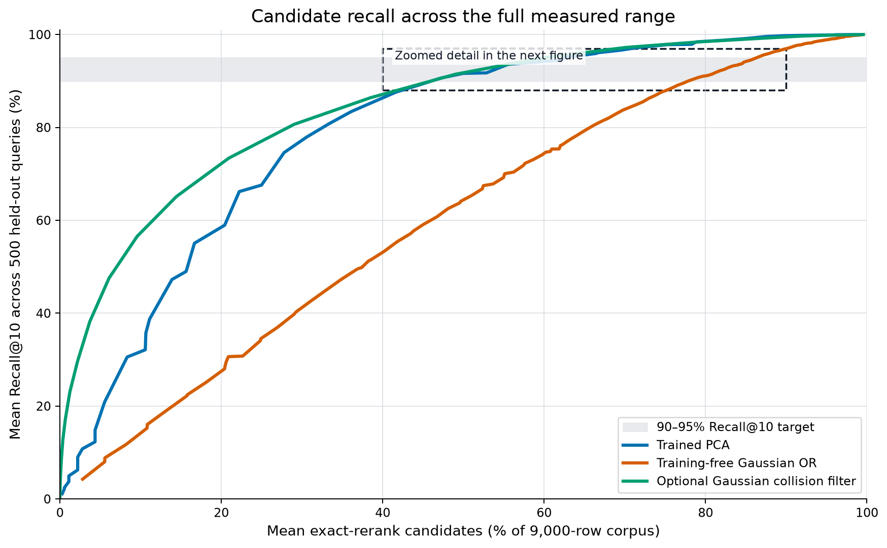
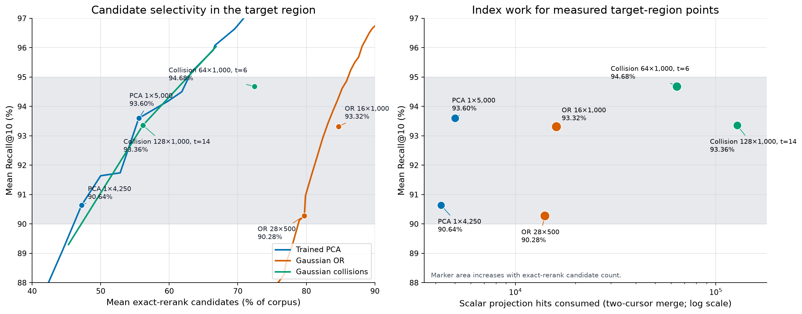
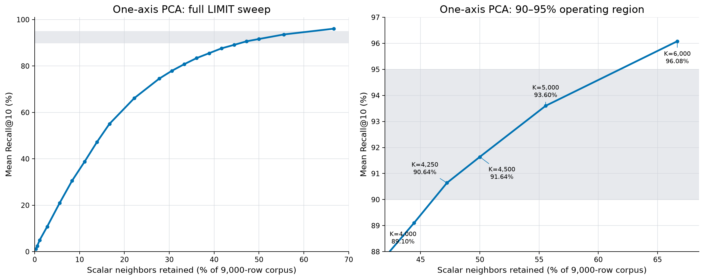
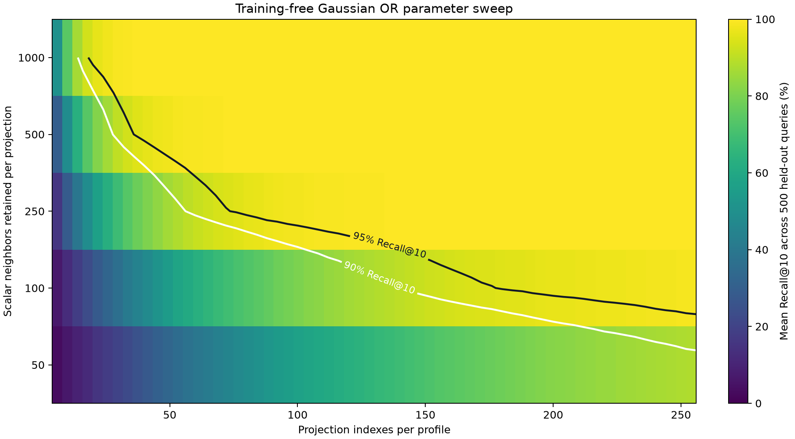
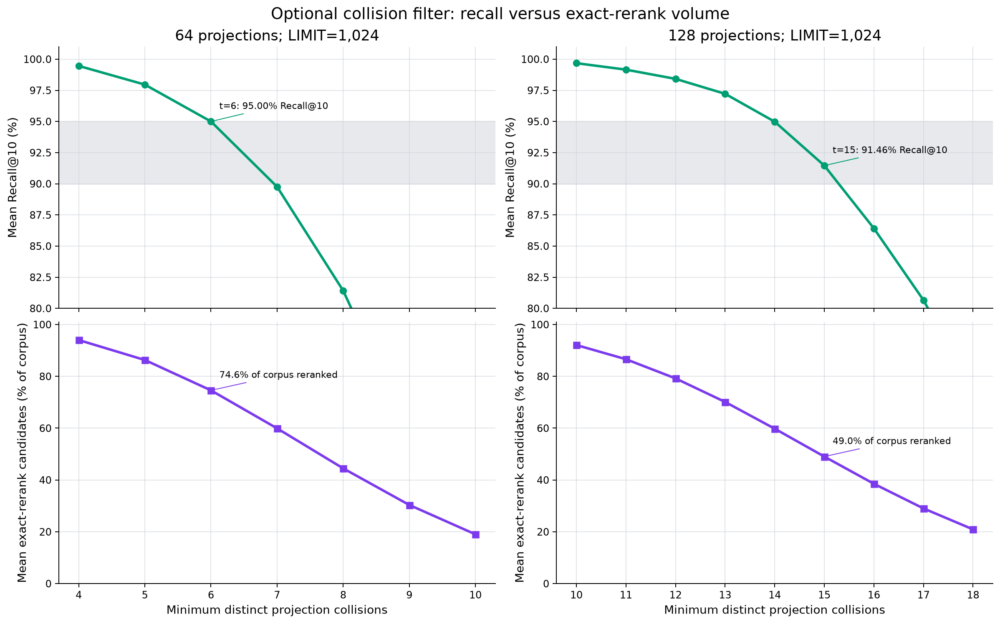
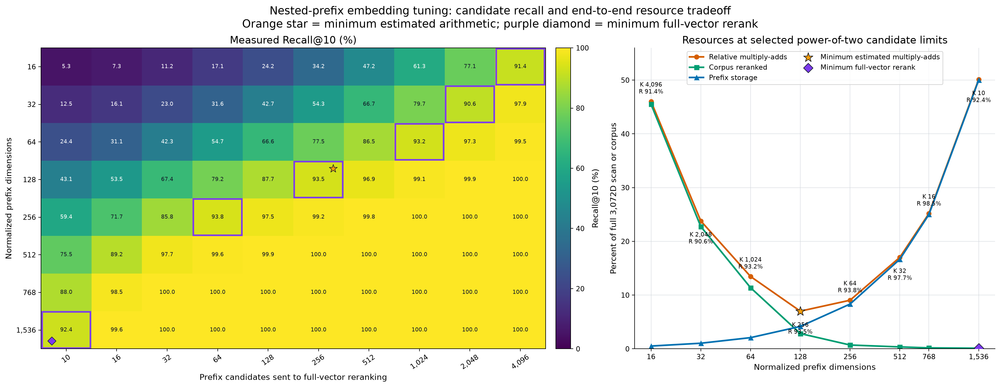
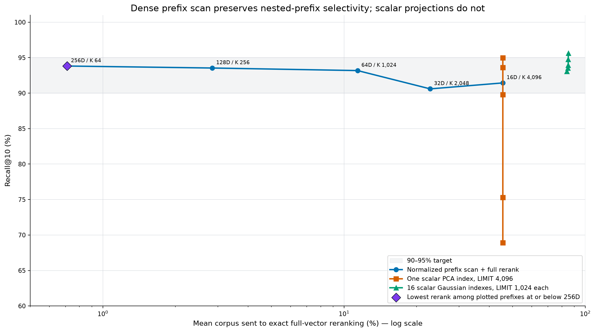

# Vector approximate-neighbor profiles

Vectors have no useful database-independent bytewise total order. Schottky therefore stores the original vector as the exact value and emits derived `Float32` projection fields for B-tree candidate retrieval. Every approximate result must be reranked with the original vector.

This guide defines two best-effort profiles:

- trained PCA projections for stable datasets;
- training-free Gaussian projections for QALSH-style multi-index retrieval.

Neither profile promises a recall level for an unseen distribution. Measure Recall@K on held-out queries before activating a profile.

## Recommended storage model

The original vector is authoritative. Projection rows are rebuildable index data tied to an immutable profile.

| Value | Storage | Invariant |
| --- | --- | --- |
| original vector | application-owned Float32 blob or native vector value | dimension and element format are schema metadata |
| projection profile | canonical `ProjectionProfile.MarshalBinary` bytes | SHA-256 fingerprint identifies exact mean and axes |
| projection value | native binary32 value | used to merge lower and upper index cursors |
| projection key | Schottky `Float32` field | five bytes: presence tag plus sortable binary32 payload |
| profile identifier | schema-managed integer or digest | every item and projection row names one profile |

Normalize cosine-search vectors through `VectorL2`. Unit vectors make cosine, dot-product, and squared Euclidean ordering equivalent.

### Serialized projection profile

`MarshalBinary` emits this canonical big-endian layout:

| Byte range | Value |
| --- | --- |
| `0..3` | ASCII `SKVP` |
| `4` | `ProjectionProfileVersion` |
| `5` | projection method |
| `6` | vector normalization |
| `7` | bit 0 indicates a stored mean |
| `8..11` | unsigned dimension count |
| `12..15` | unsigned projection count |
| remaining | optional mean followed by row-major axes, all IEEE binary32 |

PCA profiles contain one dimension-length mean. Gaussian profiles contain no mean. Reject unknown versions or flags instead of guessing their meaning.

## Profile selection

| Requirement | Profile | Initial configuration | Limitation |
| --- | --- | --- | --- |
| nested-prefix embedding model and dense prefix scoring | normalized prefix scan plus full rerank | 128D prefix, rerank about 2.9% | requires a vector scan outside scalar B-tree retrieval |
| no fitting or corpus scan | Gaussian multi-projection | 16 projections for write-sensitive partitions | measured 90% recall required reranking most of the corpus |
| stable corpus and lower read amplification | trained PCA | one projection | profile rebuild required after material distribution drift |
| optional filtering on a fixed Gaussian profile | collision threshold | tune after projection count and `LIMIT` | large projection table and query fan-out |
| small filtered partition | exact scan | no projection profile | cost grows linearly with filtered row count |

The nested-prefix scan was the most selective measured candidate path, but it requires dense vector scoring. Among scalar B-tree prefilters, PCA was the most selective. Gaussian projections remain the recommended **training-free storage format**, not the default query plan when training or prefix scanning is available.

## Go profile lifecycle

### Training-free Gaussian profile

Generate the axes once, serialize the profile, and persist its fingerprint. Do not regenerate persisted keys from the seed.

```go
profile, err := schottky.NewGaussianProjectionProfile(
    schottky.GaussianProjectionOptions{
        Dimension:     1536,
        Projections:   16,
        Seed:          20260830,
        Normalization: schottky.VectorL2,
    },
)
if err != nil {
    return err
}

profileBytes, err := profile.MarshalBinary()
if err != nil {
    return err
}
profileID := profile.Fingerprint()
```

The generator uses independent Gaussian axes. The seed is an initialization convenience inside one implementation. The serialized Float32 axes are the portable contract.

### PCA training

Train only on the corpus side of an evaluation split. Queries used to measure recall must not participate in training.

```go
profile, err := schottky.TrainPCA(samples, schottky.PCAOptions{
    Projections:   1,
    Normalization: schottky.VectorL2,
    MaxIterations: 256,
    Tolerance:     1e-8,
})
if err != nil {
    return err
}
```

`TrainPCA` performs these steps:

1. validate a rectangular finite Float32 sample matrix;
2. apply the configured normalization;
3. calculate the sample mean;
4. center the normalized samples;
5. find leading covariance eigenvectors with deterministic power iteration and Gram-Schmidt deflation;
6. canonicalize each axis sign;
7. store the mean and axes as an immutable Float32 profile.

The trainer materializes a centered Float32 sample matrix but not a dimension-squared covariance matrix. Training is an offline operation and may allocate proportional to `sample_count × dimension`.

`ErrPCAConvergence` means the configured iteration limit was insufficient. Increase `MaxIterations`; do not publish a partial profile.

### Projection write path

`Project` appends to caller-owned Float32 capacity and does not grow it.

```go
values := make([]float32, 0, profile.ProjectionCount())
values, err = profile.Project(values, vector)
if err != nil {
    return err
}

for projectionNo, value := range values {
    storage := make([]byte, 0, 5)
    builder := schottky.NewBuilder(storage)
    builder.Float32(value, schottky.AscNullsLast)
    projectionKey, err := builder.Key()
    if err != nil {
        return err
    }
    // Insert profileID, projectionNo, value, projectionKey, and item ID.
}
```

A write must store the original vector and all projection rows in one transaction. A missing projection row silently lowers recall.

## Multi-projection schema

The following names and types are templates. Adapt identity, binary, timestamp, and vector-distance types to the storage engine without changing the key order.

```sql
CREATE TABLE ann_profile (
    profile_id          BIGINT      PRIMARY KEY,
    profile_version     INTEGER     NOT NULL,
    method              VARCHAR(32) NOT NULL,
    dimension_count     INTEGER     NOT NULL,
    projection_count    INTEGER     NOT NULL,
    normalization       VARCHAR(16) NOT NULL,
    profile_fingerprint BINARY(32)  NOT NULL UNIQUE,
    profile_bytes       BLOB        NOT NULL,
    created_at          TIMESTAMP   NOT NULL,
    CHECK (dimension_count > 0),
    CHECK (projection_count > 0)
);

CREATE TABLE ann_active_profile (
    partition_id BIGINT PRIMARY KEY,
    profile_id   BIGINT NOT NULL,
    FOREIGN KEY (profile_id) REFERENCES ann_profile (profile_id)
);

CREATE TABLE ann_item (
    partition_id    BIGINT NOT NULL,
    item_id         BIGINT NOT NULL,
    dimension_count INTEGER NOT NULL,
    embedding       BLOB   NOT NULL,
    PRIMARY KEY (partition_id, item_id)
);

CREATE TABLE ann_projection (
    profile_id       BIGINT     NOT NULL,
    partition_id     BIGINT     NOT NULL,
    projection_no    INTEGER    NOT NULL,
    projection_key   BINARY(5)  NOT NULL,
    projection_value REAL       NOT NULL,
    item_id          BIGINT     NOT NULL,
    PRIMARY KEY (
        profile_id,
        partition_id,
        projection_no,
        projection_key,
        item_id
    ),
    CHECK (projection_no >= 0),
    FOREIGN KEY (profile_id)
        REFERENCES ann_profile (profile_id),
    FOREIGN KEY (partition_id, item_id)
        REFERENCES ann_item (partition_id, item_id)
);
```

The primary-key order is required:

```text
profile → partition → projection number → projection key → stable item tie-break
```

It supports independent range scans for every projection while keeping one physical schema for profiles with different projection counts. A wide table with one column and index per projection is faster in some engines but makes profile replacement and variable projection counts operationally expensive.

### Storage amplification

A profile with `m` projections writes `m` rows per vector.

```text
projection rows = vector rows × projection count
```

Use 16 projections only when write amplification is acceptable. Profiles with 64–128 projections belong in read-heavy or analytical partitions, not high-churn transactional tables.

## Exact scalar top-K from a B-tree

The benchmark retrieves the `K` smallest absolute scalar differences per projection. A B-tree exposes two ordered streams around the query key:

- lower values in descending order;
- equal or higher values in ascending order.

An application can compare the current absolute differences and advance the closer cursor until it consumes exactly `K` rows. This costs approximately `m × K` scalar hits across `m` projections.

A static SQL query normally materializes up to `K` rows from each direction and then keeps the closest `K`. Its read upper bound is `2 × m × K`.

Fetching `K/2` from each direction is cheaper but is not exact scalar top-K when nearby values are concentrated on one side.

## SQL union and exact rerank

This two-projection example shows the complete static-SQL path. Generate one `axis_n_pool` and `axis_n` pair per projection.

```sql
WITH
axis_0_pool AS (
    SELECT item_id, projection_no, projection_value
    FROM (
        (
            SELECT item_id, projection_no, projection_value
            FROM ann_projection
            WHERE profile_id = :profile_id
              AND partition_id = :partition_id
              AND projection_no = 0
              AND projection_key >= :query_key_0
            ORDER BY projection_key ASC, item_id ASC
            LIMIT :per_projection_neighbors
        )
        UNION ALL
        (
            SELECT item_id, projection_no, projection_value
            FROM ann_projection
            WHERE profile_id = :profile_id
              AND partition_id = :partition_id
              AND projection_no = 0
              AND projection_key < :query_key_0
            ORDER BY projection_key DESC, item_id ASC
            LIMIT :per_projection_neighbors
        )
    ) AS two_sides
),
axis_0 AS (
    SELECT item_id, projection_no
    FROM axis_0_pool
    ORDER BY ABS(projection_value - :query_value_0), item_id
    LIMIT :per_projection_neighbors
),
axis_1_pool AS (
    SELECT item_id, projection_no, projection_value
    FROM (
        (
            SELECT item_id, projection_no, projection_value
            FROM ann_projection
            WHERE profile_id = :profile_id
              AND partition_id = :partition_id
              AND projection_no = 1
              AND projection_key >= :query_key_1
            ORDER BY projection_key ASC, item_id ASC
            LIMIT :per_projection_neighbors
        )
        UNION ALL
        (
            SELECT item_id, projection_no, projection_value
            FROM ann_projection
            WHERE profile_id = :profile_id
              AND partition_id = :partition_id
              AND projection_no = 1
              AND projection_key < :query_key_1
            ORDER BY projection_key DESC, item_id ASC
            LIMIT :per_projection_neighbors
        )
    ) AS two_sides
),
axis_1 AS (
    SELECT item_id, projection_no
    FROM axis_1_pool
    ORDER BY ABS(projection_value - :query_value_1), item_id
    LIMIT :per_projection_neighbors
),
projection_hits AS (
    SELECT item_id, projection_no FROM axis_0
    UNION ALL
    SELECT item_id, projection_no FROM axis_1
),
candidate_ids AS (
    SELECT
        item_id,
        COUNT(DISTINCT projection_no) AS collision_count
    FROM projection_hits
    GROUP BY item_id
    HAVING COUNT(DISTINCT projection_no) >= :minimum_collisions
    ORDER BY collision_count DESC, item_id
    LIMIT :candidate_cap
)
SELECT
    item.item_id,
    vector_distance(item.embedding, :query_embedding) AS exact_distance
FROM candidate_ids AS candidate
JOIN ann_item AS item
  ON item.partition_id = :partition_id
 AND item.item_id = candidate.item_id
ORDER BY exact_distance ASC, item.item_id ASC
LIMIT :result_count;
```

`vector_distance` denotes an engine function or application UDF that decodes the original vector and computes the exact configured metric. It is not a Schottky key comparison.

Set `minimum_collisions = 1` for pure OR. Higher values implement QALSH-style collision filtering. The `candidate_cap` must be no smaller than the measured candidate p95 for the selected profile; a lower cap changes recall.

For 64–128 projections, prefer application-managed two-cursor scans or generated statements over a handwritten SQL CTE with hundreds of branches.

## Query-centered range mode

The same schema supports query-centered QALSH ranges instead of fixed scalar top-K. For projection `i`, encode lower and upper Float32 bounds around the query projection:

```text
query_projection[i] - radius ≤ item_projection[i] ≤ query_projection[i] + radius
```

Scan every projection range, count distinct projection collisions, rerank exact vectors, and expand `radius` when too few candidates survive. Range mode is closer to the original QALSH algorithm; the benchmark below measures fixed scalar top-K because it gives a comparable row budget across projections.

## Tuned operating points

The measurements use a 10,000-row, 1,536-dimensional, unit-normalized public text-embedding sample. A fixed split produced 9,000 corpus rows and 500 held-out queries. Ground truth is exact cosine top-10. Recall@10 is the fraction of exact neighbors present after candidate extraction and exact reranking.

### Trained PCA

PCA was trained only on the 9,000 corpus rows. One axis was more selective than multi-axis PCA at the measured 90–95% operating band.

| PCA axes | Scalar neighbors per axis | Mean candidates | Corpus reranked | Recall@10 |
| ---: | ---: | ---: | ---: | ---: |
| 1 | 4,250 | 4,250 | 47.2% | 90.64% |
| 1 | 4,500 | 4,500 | 50.0% | 91.64% |
| 1 | 5,000 | 5,000 | 55.6% | 93.60% |
| 1 | 6,000 | 6,000 | 66.7% | 96.08% |

Recommended measured starting points:

- target near 90%: one PCA axis, `K = ceil(0.47 × partition_rows)`;
- target near 94%: one PCA axis, `K = ceil(0.56 × partition_rows)`.

These fractions are initial values for similar distributions, not portable guarantees.

### Training-free Gaussian OR

| Projection indexes | Scalar neighbors per projection | Scalar hits consumed by two-cursor merge | Mean candidates | Corpus reranked | Recall@10 |
| ---: | ---: | ---: | ---: | ---: | ---: |
| 16 | 1,024 | 16,384 | 7,688 | 85.42% | 93.98% |
| 32 | 512 | 16,384 | 7,609 | 84.55% | 93.74% |
| 64 | 256 | 16,384 | 7,569 | 84.10% | 93.22% |
| 128 | 128 | 16,384 | 7,549 | 83.88% | 93.40% |
| 256 | 64 | 16,384 | 7,540 | 83.78% | 93.38% |

Static two-sided SQL may read up to twice the listed scalar-hit count. All five profiles consume 16,384 scalar hits, so there is no single optimum. The 16-projection profile minimizes projection rows and write/storage amplification; the 256-projection profile minimizes exact reranking. Moving from 16 to 256 projections writes sixteen times more projection rows to reduce the rerank share by 1.64 percentage points.

### Optional Gaussian collision filtering

| Projection indexes | Neighbors per projection | Minimum collisions | Scalar hits consumed by two-cursor merge | Mean candidates | Corpus reranked | Recall@10 |
| ---: | ---: | ---: | ---: | ---: | ---: | ---: |
| 64 | 1,024 | 6 | 65,536 | 6,714 | 74.60% | 95.00% |
| 128 | 512 | 6 | 65,536 | 6,632 | 73.69% | 94.14% |
| 128 | 1,024 | 14 | 131,072 | 5,382 | 59.80% | 94.98% |
| 128 | 1,024 | 15 | 131,072 | 4,413 | 49.04% | 91.46% |

At 128 projections and `LIMIT 1,024`, threshold 16 reduced the exact-rerank share to 38.5% but also reduced Recall@10 to 86.42%. Collision filtering improves candidate selectivity at the cost of substantially more index reads and storage. Collision count is not a primary ANN quality metric: use Recall@K, exact-rerank share, scalar hits, and projection-row amplification for profile selection. Treat the threshold only as an internal filter after projection count and per-index `LIMIT` are fixed.

## Benchmark figures

The figures follow the decision sequence: compare strategies, inspect the 90–95% operating region, tune the trained profile, tune the training-free profile, then inspect collision filtering only when that optional query path is enabled.

### Strategy overview



The overview uses Pareto frontiers without a marker at every measurement. The dashed rectangle identifies the region expanded below, avoiding unreadable point clusters near the top of the full-range chart.

### Target operating region and index work



The left panel expands Recall@10 from 88% to 97% and labels the measured operating points. The right panel places the same points on a logarithmic scalar-hit axis. Marker area increases with the number of vectors sent to exact kNN reranking. The orange star identifies the measured B-tree point that simultaneously used the fewest projection rows, scalar hits, and rerank candidates in the target band: trained PCA with one axis and `K=4,250`.

Scalar hits assume application-managed lower/upper cursor merging. Static SQL that materializes `K` rows from both directions may read up to twice the displayed count.

### Trained PCA LIMIT tuning



The left panel retains the complete response curve. The right panel isolates the 90–95% band and labels the exact `K` values, including the first measured point above 95%.

### Training-free Gaussian OR tuning



The left matrix prints measured Recall@10. The right matrix prints the mean percentage of corpus vectors that proceed to exact kNN reranking. Purple outlines identify 90–95% Recall@10 cells in both panels. Among the equal-16,384-hit profiles, the orange star marks the minimum-write point at 16 projections with `LIMIT 1,024`; the purple diamond marks the minimum-rerank point at 256 projections with `LIMIT 64`.

The matrix includes 4, 8, 12, and 16 projections. With `LIMIT 1,024` per projection, their measured Recall@10 values were 51.30%, 75.36%, 87.38%, and 93.98%. Sixteen projections were the first tested count at or below 16 to enter the 90–95% target band.

### Optional collision-filter diagnostic



The top row isolates Recall@10 from 80% to 100%; the bottom row shows the corresponding exact-rerank fraction. Increasing the threshold reduces both quantities. The annotations mark the last measured threshold above 90% for each displayed profile.

Threshold values are not comparable across different projection counts or per-index limits. The curves diagnose one fixed profile; they are not an operational KPI. Every configured per-projection hit is read before collision filtering, so the threshold reduces exact reranking but not the preceding index reads.

Source rows for all figures are in [`vector-ann-benchmark.csv`](assets/vector-ann-benchmark.csv).

## Nested-prefix embedding experiment

The [public 3,072D nested-prefix embedding sample](https://huggingface.co/datasets/allura-forge/gemini-embedding-2-preview-embeddings) adds a materially different option: rank every row with a normalized prefix, then rerank that prefix candidate set with the full 3,072-dimensional vector. The source model uses nested-prefix representation learning, so its prefixes retain more neighborhood structure than arbitrary truncation.

[The source model API supports 128–3,072 output dimensions and recommends 768, 1,536, or 3,072](https://ai.google.dev/gemini-api/docs/models/gemini-embedding-2-preview). The 16D and 32D measurements below intentionally test the lower-dimension hypothesis outside that supported range; they are diagnostics, not production model settings. The experiment sliced the stored 3,072D vectors and L2-normalized every prefix before cosine scoring. [API-produced truncated vectors from the source model are already normalized](https://ai.google.dev/gemini-api/docs/embeddings#quality-for-smaller-dimensions).

### Dense prefix-scan tuning

For each $(d, K)$ configuration, the experiment computes cosine similarity on the normalized $d$-dimensional prefix for every one of the 9,000 filtered corpus rows, retains the top-$K$ candidates, and reranks only those candidates with the full 3,072-dimensional vectors. Tuning means selecting $d$ and $K$ under explicit recall, scan, storage, and rerank constraints; it does not train the embedding.

| Prefix dimensions | Full-vector rerank candidates | Corpus reranked | Prefix storage versus 3,072D | Relative multiply-adds | Recall@10 |
| ---: | ---: | ---: | ---: | ---: | ---: |
| 16 | 4,096 | 45.51% | 0.52% | 46.03% | 91.44% |
| 32 | 2,048 | 22.76% | 1.04% | 23.80% | 90.60% |
| 64 | 1,024 | 11.38% | 2.08% | 13.46% | 93.18% |
| **128** | **256** | **2.84%** | **4.17%** | **7.01%** | **93.54%** |
| **256** | **64** | **0.71%** | **8.33%** | **9.04%** | **93.82%** |
| 512 | 32 | 0.36% | 16.67% | 17.02% | 97.74% |
| 768 | 16 | 0.18% | 25.00% | 25.18% | 98.46% |
| **1,536** | **10** | **0.11%** | **50.00%** | **50.11%** | **92.36%** |

The relative multiply-add estimate is:

$$
\frac{dN + 3{,}072K}{3{,}072N}
= \frac{d}{3{,}072} + \frac{K}{N},
$$

where $d$ is the prefix dimension, $N=9{,}000$ is the filtered corpus, and $K$ is the full-vector rerank count. It excludes memory bandwidth, index traversal, and result materialization.



The result does not support using 16D or 32D for a narrow prefix-only top-K search. Their prefix-only top-10 Recall@10 values were only 5.26% and 12.54%. They exceed 90% only after sending 45.51% or 22.76% of the corpus to full-vector reranking. There is no single optimum in the 90–95% band: 128D with 256 candidates minimizes estimated multiply-adds; 1,536D with 10 candidates minimizes full-vector reranking but consumes half of a full-vector scan and adds 50% prefix storage. Under a prefix cap of 256D, 256D with 64 candidates has the smallest rerank share. For a target above 95%, the measured arithmetic choices are close: 128D with 512 candidates reached 96.86% recall at 9.86% relative multiply-adds, while 256D with 128 candidates reached 97.52% at 9.76%.

### Scalar B-tree comparison

Nested-prefix selectivity comes from scoring the prefix as a vector. Re-projecting that prefix to one or more scalar B-tree keys discards most of the benefit:

| Candidate path on 128D prefix | Projection indexes | Per-index `LIMIT` | Corpus reranked | Recall@10 |
| --- | ---: | ---: | ---: | ---: |
| normalized prefix scan | 0 | 256 total | 2.84% | 93.54% |
| trained PCA | 1 | 4,096 | 45.51% | 93.62% |
| Gaussian OR | 16 | 1,024 | 84.96% | 94.76% |



Use the dense prefix-scan path when the storage engine or application can score every prefix in the already-filtered partition. If only scalar B-tree access is available, `ProjectionProfile` can project `embedding[:d]`, but lower $d$ reduces projection computation rather than projection-row count or query fan-out. Scalar projection does not reproduce dense prefix-scan candidate selectivity.

### Storage and query application

Store these values as one versioned embedding profile:

| Value | Purpose |
| --- | --- |
| full 3,072D Float32 vector | exact final score and migration source |
| normalized 128D or 256D prefix | first-stage dense scan without reading the full vector |
| model, task format, full dimension, prefix dimension, normalization | prevents incompatible query and corpus vectors from mixing |
| validated candidate fraction and corpus fingerprint | ties `K` to the measured post-filter distribution |

Derive the stored prefix from the same full embedding, normalize it once, and store it separately. Computing the prefix from the full corpus blob during a query defeats the read-bandwidth benefit.

This two-stage path requires a full 3,072D query vector. Request or compute the 3,072D API output and retain it through both stages; requesting only a 128D or 256D output leaves no compatible query for exact cosine reranking against the stored 3,072D corpus vectors.

Query execution is:

1. obtain and retain the full 3,072D query vector;
2. apply tenant and business predicates;
3. slice `full_query[:d]` and L2-normalize it with the corpus profile's exact dimension;
4. score the normalized prefix against every prefix vector in the filtered partition;
5. retain `K = ceil(candidate_fraction × partition_rows)`; use a fixed power-of-two bucket only when that exact bucket was validated;
6. fetch the full vectors for those IDs and use the retained full query to return exact cosine top-10.

For a measured target near 94%, start at 128D and a 2.84% candidate fraction when prefix-scan arithmetic is the primary constraint, or 256D and a 0.71% candidate fraction when prefix dimensions are capped at 256 and full-vector reads are more expensive. If minimizing full-vector rerank alone justifies a 50%-size prefix, 1,536D with a 0.11% candidate fraction is the measured point. For a measured target above 95%, start at 256D and a 1.42% candidate fraction. These are benchmark starting points, not portable guarantees. Revalidate after model, task-prefix, corpus, filter, or embedding-version changes.

## Reproducibility metadata

### Standard 1,536D projection sample

| Property | Value |
| --- | --- |
| source rows | 10,000 |
| dimensions | 1,536 |
| corpus rows | 9,000 |
| held-out queries | 500 |
| query count used in each mean | 500 |
| exact result count | 10 |
| split and projection seed | `20260830` |
| vector subset SHA-256 | `6ea192c75d72419cfcc53f5c77175dbdda2d2ad644544bb653931176ace0fcff` |
| projection-key precision | Float32 |
| PCA training | exact covariance eigendecomposition for the benchmark |
| Gaussian retrieval | exact absolute scalar top-K before OR or collision filtering |

### Nested-prefix 3,072D sample

| Property | Value |
| --- | --- |
| source | [public 3,072D nested-prefix embedding dataset](https://huggingface.co/datasets/allura-forge/gemini-embedding-2-preview-embeddings) |
| source rows | 10,000 across ten Parquet shards |
| dimensions | 3,072 |
| corpus rows | 9,000 |
| held-out queries | 500 |
| query count used in each mean | 500 |
| exact result count | 10 |
| split and projection seed | `20260830` |
| Float32 subset artifact SHA-256 | `4817503e4377e91fae126171c2da7443f5efbaefb3fd68d455495d284e98a6d7` |
| prefix dimensions | 8, 16, 32, 64, 128, 256, 512, 768, 1,536, 3,072 |
| prefix preprocessing | slice full vector, cast to Float32, then L2-normalize |
| candidate limits | 10, 16, 32, 64, 128, 256, 512, 1,024, 2,048, 4,096 |
| exact ground truth | cosine top-10 on normalized 3,072D vectors |

Both experiments measure candidate recall in memory. They do not measure storage-engine latency, buffer-cache behavior, transaction contention, network round trips, or production asymmetric query/document task formatting.

## OLTP operation

- Partition by the tenant or business predicate used in every query; tune against the post-filter row count.
- Prefer exact scan for small partitions.
- Prefer one-axis PCA when a representative training sample and profile rebuild are acceptable.
- Limit training-free profiles to 16 projections on write-sensitive tables.
- Insert the item and all projection rows atomically.
- Keep a stable item ID in the index to make Float32 ties deterministic.
- Record candidate count, scalar hits, and exact-distance calls per query.

Do not advertise 90% recall from the 16-projection preset without a held-out evaluation. Its measured recall required reranking 84.7% of the sample corpus.

## HTAP operation

- Train PCA from a stable analytical snapshot, not an uncommitted transactional scan.
- Backfill a new profile ID without mutating active projection rows.
- Dual-write active and replacement profiles during a long backfill.
- Validate recall and candidate p95 before switching the active profile.
- Retire the old profile only after readers stop referencing it.
- Use 64–128 Gaussian projections only when read concurrency, storage amplification, and index fan-out have been measured.

## Drift and profile replacement

Retrain PCA when held-out recall falls below the schema target or the input distribution changes materially. Replacing the mean or any axis changes every projection key.

A clean replacement sequence is:

1. train and serialize a new profile;
2. insert a new immutable profile row;
3. backfill its projection rows;
4. evaluate held-out Recall@K and candidate p95;
5. start dual writes;
6. atomically switch the active profile ID;
7. drain old readers;
8. delete obsolete projection rows.

Never overwrite `profile_bytes` under an existing profile ID.
